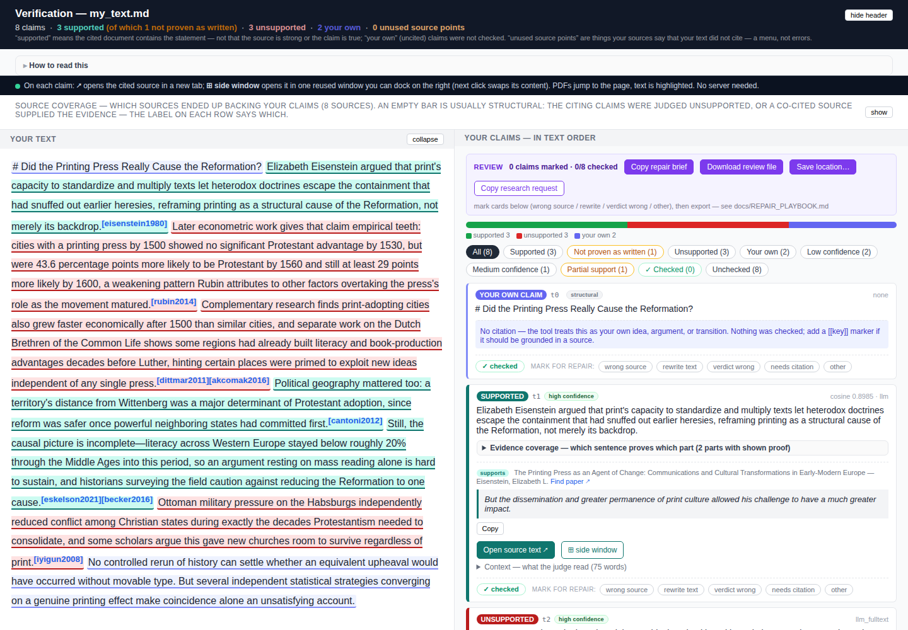

# Claim grounding — alpha test release

This tool checks cited writing against its sources. It reads your text
and finds every sentence with a citation. It then checks each such
sentence against the actual source PDF or text file, using a language
model. The result is a single file, `viewer.html`, that opens in any
browser. Nothing runs on a server, and there is no account to create.

Every checked sentence gets one of three verdicts:

- **supported** — the source contains the statement. The exact proof
  sentences are quoted from the source.
- **unsupported** — no cited source backs the statement. The card says
  what is missing or contradicted.
- **your own claim** — your uncited sentences (thesis, framing, opinion).
  They are labeled but not checked.

This is an **alpha test release**. It works end to end, and its judging
has been measured against hand-checked papers (see `FOR_REVIEWERS.md`).
Still, expect rough edges. When a verdict looks wrong or something
crashes, please tell us. Reports like that are the reason for an alpha
test.

## 1. The main use case: check a text an AI wrote for you

AI research tools can write a cited text on any topic in minutes.
Claude's Research feature, ChatGPT's deep research, Elicit, and
Perplexity all do this. The open question is always the same: do the
cited papers really say what the text claims? This tool answers that
question sentence by sentence, with quotes.

Here is the whole loop, exactly as we ran it in August 2026:

1. **Ask the research tool to write the text.** Copy the prompt from
   `RESEARCH_WRITE_PROMPT.md` (shipped in this repository), add
   your topic, and give it to the research tool. The prompt makes the
   tool put one citation marker on each sourced sentence, like this:
   `Cities that had a printing press by 1500 were more likely to turn
   Protestant by 1560. [[rubin2014]]`
2. **Save the output as two files.** The text goes into `my_text.md`.
   The reference list goes into `my_text.md.refs.txt`, one line per
   source: `rubin2014 = rubin2014.pdf`.
3. **Collect the source files.** Download each reference into a
   `sources/` folder, under the file name used in the refs file. The
   research tool's reference list gives you the links. For Claude
   research exports, `import_claude_research.py` and
   `download_sources.py` do steps 2 and 3 for you (section 6).
4. **Run the check:**

       venv/bin/python verify_my_text.py \
         --text my_text.md \
         --sources sources \
         --references my_text.md.refs.txt \
         --output-dir runs/my_check --open

5. **Read the result.** `viewer.html` opens with your text on the left
   and one card per claim on the right, each with its verdict and the
   quoted proof sentences.

**What this produced in our test.** We gave Claude (the Sonnet model)
the prompt above, eight real research papers, and a topic. The topic
was what researchers have measured about the printing press and the
Reformation. Claude wrote 421 words with 11 cited claims. The tool then
checked the result on the free Claude Code backend. That took 40
minutes and cost nothing.

All 11 cited claims came back **supported**, each with quoted proof
sentences from its source. The one uncited closing sentence was
correctly labeled **your own claim**. On two claims the first pass
could not show proof for every part. The arbiter (also free on this
backend) settled both by fetching the exact missing sentences from the
papers. One claim got a "partial support?" reminder chip to
double-check.

The research tool had followed the prompt's rules, and the check
confirmed it. This is the result the tool exists to give you: a verdict
backed by quotes a human can check in seconds.

The same check catches the failure case just as visibly. When a claim
says more than its source does, the card comes back **unsupported** or
flagged, and names the part that has no proof. Section 7 shows what
those cards look like.

### The easiest way: let an agent tool run the whole loop

The five steps above assume you move text between tools by hand. An
agent tool — Claude Code, or any equivalent that can both use a model
and run commands — can do the loop for you. Ask it to research and
write the text with the prompt, save the two files, collect the
sources, and run the check. Then ask it to read the verdict cards,
rewrite any sentence that came back unsupported, and run the check
again. An agent also makes fewer format mistakes in step 2. It writes
the two files directly instead of you copying text out of a chat
window.

A ready-made prompt for the agent is in `AGENT_LOOP_PROMPT.md` (shipped
in this repository). It walks the agent through all the steps and their
safety rules. For the text itself it points the agent at the writing
prompt, so the two prompts stay separate.

If your agent tool is Claude Code, there is a shorter way. This
repository ships the loop as a skill. A skill is a saved instruction
sheet that Claude Code loads when you type its name. Open Claude Code
in the repository folder and type `/checked-research` followed by your
topic. The session then runs the whole loop itself: the research, the
two files, the sources, the check, and one repair round.

The research step runs on whatever model your session uses, so pick
the model first. The testing note below applies to the skill as well.

Our own example above was made this way: Claude Code wrote the text,
saved the files, and ran the check with no hand copying. For the
rewrite step it has a ready-made command, `/apply-review` (section 7).

We ran the full loop, including the automatic rewrite, end to end in
August 2026. An agent researched a podcast episode and wrote a
five-entry page of checkable claims. It saved both input files in the
right format on the first try, with no hand-fixing.

The check found three claims that said more than their sources do. The
agent rewrote two of them from the checker's quoted feedback, and the
re-check proved both. The third stayed marked unsupported because its
source sits behind a download block, which is the honest outcome.
Checking cost about 15 cents in model fees and the writing cost
nothing extra.

Two honest notes from that test. The agent first tried a shortcut.
It saved its own summaries as source files instead of the real
documents, which would have made the check worthless. The skill now
forbids exactly that, and the check itself caught the resulting gaps.

And we have only tested the loop with Claude Code so far. Testing
whether other research tools can produce the two files is still open.
This section will get those results.

## 2. Install (two commands, then a large download)

Needs Python 3.10 or newer.

    cd claim-grounding
    python3 -m venv venv
    venv/bin/pip install -r requirements.txt

Windows: `venv\Scripts\pip install -r requirements.txt`, and use
`venv\Scripts\python` wherever this page says `venv/bin/python`.

The install is large. It pulls **about 1.5 GB of libraries** (the
CPU version of torch and the text-similarity stack). The first run
downloads a **~0.4 GB local text-similarity model** on top. Most of
the install time is the download itself. After that, everything
similarity-related runs locally on your CPU. No GPU is needed.

Optional but recommended on Linux and Mac: the `poppler-utils` package.
It provides `pdftotext`, which recovers text from PDFs that other
extractors read incorrectly.

## 3. Give it a model (an API key, or a free no-key option)

The judging model is your choice. Any ONE of these works:

- **The default — Google's free tier ($0):** put a free Google AI
  Studio key in `config/google_api_key.txt`. It is picked up
  automatically. The default model is **Gemma** (a Google model), and
  on the free tier it costs nothing. The trade-off is speed. The free
  tier limits how many requests per minute it accepts, so the run
  spends much of its time waiting its turn. Leave it running in the
  background — do not choose it when you are in a hurry.
- **The same model, paid and fast:** create a key at openrouter.ai,
  then `export OPENROUTER_API_KEY=...` and add
  `--model openrouter/google/gemma-4-31b-it` to the run command. This
  is the same judge without the waiting, and a short essay costs a few
  cents.
- **No key at all ($0):** if you have Claude Code installed and logged
  in, add `--backend claude-code`. It is free through your Claude
  subscription but slow, taking minutes per claim, which is fine for a
  short text.
- **Fully local ($0, no internet):** an Ollama model. `LOCAL_MODELS.md`
  records what we found: local models run, but none has yet been
  validated against the hand-checked accuracy benchmarks our hosted
  judge passed. Treat a local run as a rough draft. Do not rely on its
  verdicts yet.

On the default free tier a run costs **$0.00**. On a paid model a short
essay costs **a few cents**. Every run starts with one tiny test call
and stops immediately with a clear message if the key does not work. It
prints a cost estimate up front and asks for confirmation before
anything expensive (above about $1). At the end it prints the actual
cost next to that estimate. `--estimate` prints the estimate and exits
without calling any model.

### The arbiter — a second model for the flagged claims (optional)

The **arbiter** is a second model that re-reads every claim the run
flagged, together with the cited source. Sources up to 30,000 words are
sent whole. Longer ones send their most relevant section of about
20,000 words. When it finds proof sentences the first pass missed, it
attaches them to the card, word-for-word checked against the source.

The arbiter is on by default but needs its own key:
`OPENROUTER_API_KEY` or
`config/openrouter_api_key.txt`. It adds a few cents per run. Without
a key, the arbiter step is skipped with a one-line note, and the rest
of the run continues normally. On
`--backend claude-code` it runs through your Claude login at no cost,
nothing to set up.

**The cheap mixed setup.** The two choices combine. You can run the
free Gemma judge with your Google key and route only the arbiter
through a Claude subscription. Add `--arbiter claude-code/sonnet` to
the run command. The judging model is still free, the arbiter is a
strong model, and the total API cost is $0.

We measured whether the arbiter is worth using. One demo essay with 54
claims ran with and without it, same text and judging model:

- Without it, the run raised 7 "not proven as written" flags.
- With it, the arbiter re-read 14 flagged claims and cleared 3 of the 7
  flags by fetching the exact missing sentences from the sources. All
  three were retrieval misses, not real gaps.
- The 4 flags that survived were genuine over-claims that the author
  then needed to rewrite.

That demo cost $0.04 with the arbiter model we used at the time
(DeepSeek). With today's default arbiter (OpenAI's gpt-5.6-luna, which
won our model comparison) the same run would cost a few cents more.

The arbiter never decides a verdict by itself. There is one optional
exception, and it works only in the claim's favor. Start the run with
`--arbiter-rescue`, and a falsely rejected claim can flip to
supported. The flip happens only when the arbiter's verified proof
convinces the first judging model on a re-read, and the card says so.

This flip used to be on by default. We turned it off on 2026-09-01
after a measurement. We re-ran the same rejected claims three times
each with the current arbiter model. Some runs flipped a claim and
some did not, and a verdict change should not depend on which run you
happened to get. Without the flag, the arbiter's verified find still
appears on the rejected card as a "proof may exist" note. The verdict
stays what the judge decided.

### How long a run takes

For a one-page text (about 8–15 cited claims), first-run times:

| Backend | First run | Cost |
|---|---|---|
| free Google tier (the default) | **slow — plan in hours, not minutes.** The free tier paces requests; our six-document benchmark run took just under four hours, about forty minutes per document | $0 |
| paid key (`openrouter/google/gemma-4-31b-it`) | minutes to tens of minutes — much of it is local processing of the source PDFs, not the model | cents |
| `--backend claude-code` | measured twice: **34.5 min** on a 309-word, 8-claim essay and **40 min** on a 421-word, 11-claim text — expect half an hour to an hour | $0 |
| local Ollama model | depends on your hardware and model size — see `LOCAL_MODELS.md` | $0 |

Longer texts scale with the number of cited claims. Re-runs of the same
text into the same output folder are much faster and nearly free.
Unchanged claims reuse their previous verdicts, and the processed
sources are cached. `--concurrency N` raises the number of parallel
model calls (default 4).

## 4. Run the bundled example (a few minutes)

The repository includes a small ready-to-run project:
`examples/chimpanzee_validation/` — a short text about a chimpanzee
behavior study, with its source PDF already included. Nothing to
download:

    venv/bin/python verify_my_text.py \
      --text examples/chimpanzee_validation/my_text.md \
      --sources examples/chimpanzee_validation/sources \
      --output-dir runs/example --open

`--open` launches `viewer.html` when done. A larger example with nine
sources is in `examples/bentonite/`. Two of its sources are
subscription-only papers we may not redistribute. Its README explains
which two files to fetch yourself.

## 5. Or let the wizard ask you everything

Run the verifier with **no arguments** and it asks instead of demanding
flags:

    venv/bin/python verify_my_text.py

Five steps: text → sources → output folder → model and key → run
options. Ground rules for all of them:

- The value in `[brackets]` is the default — **Enter** accepts it.
- **Tab** completes file and folder paths.
- **Ctrl+C** aborts at any point: nothing runs, and nothing is spent.
  The wizard
  itself never calls a model. The normal cost estimate and confirmation
  still come before the actual run.

The wizard also fixes problems as it goes:

- **Text file** — if the file turns out to be a Claude research export,
  it offers to convert it on the spot (free, offline). If it has no
  citation markers at all, it warns you that nothing would be verified.
- **Sources** — it checks that every cited key has a real file in your
  sources folder. Missing ones are listed with title, year and link, and
  if a download manifest is found it offers to fetch the open-access
  ones right there. Whatever is still missing you can continue without —
  those claims are marked "source file missing" on their card. The
  tool does not guess a replacement source.
- **Model and key** — a menu of the options from section 3. Project key
  files and environment variables are picked up automatically.
- **Run options** — concurrency, an optional second-opinion pass, and
  whether to open the viewer when done.

At the end it prints the equivalent one-line command, so you can skip
the wizard next time.

## 6. Check your own existing text

The tool needs three things (full contract: `INPUT_FORMAT.md`):

1. **Your text** with a citation marker ` [[key]]` after each cited
   sentence.
2. **A refs file** (`<your text>.refs.txt`) mapping each key to a source
   file: `zhong2019 = zhong2019.pdf`, one per line.
3. **A sources folder** with those files (`.pdf` or `.txt` — plain-text
   formats such as Markdown are read as text).

The marker format is extra work for now. The goal is that a future
version accepts any normally-cited text as it is. Until then, three
converters cover the common cases:

- **A draft with normal citations** (footnotes, "(Smith 2020)", numbered
  references): give `CONVERT_MY_TEXT_PROMPT.md` and the draft to
  the LLM that wrote or knows your text. It inserts the markers and
  builds the refs file, and its warnings section tells you what to
  review by hand. Review its output before running — especially that it
  did not invent a citation you never made.
- **A published paper** (PDF, DOI or arXiv link): `import_paper.py`
  converts it, citations and reference list included. A paper can then
  be checked against its own cited sources. No model calls:

      venv/bin/python import_paper.py --doi 10.1234/example --output-dir data/that_paper

- **A Claude research report** (pandoc `[@key]` export plus `.bib`
  bibliography):

      venv/bin/python import_claude_research.py --input report.md --output-dir data/my_article

Both importers also write a `sources_manifest.json`. Then
`download_sources.py` fetches the open-access sources for you. It also
writes `download_report.md`, which lists every source it could not
fetch, each with a link and a "save as" file name:

    venv/bin/python download_sources.py --manifest data/my_article/sources_manifest.json

Paywalled papers you download yourself go into the project's `inbox/`
folder. Then `ingest_downloads.py` files them: it matches each file to
its reference by key, DOI or title, renames it, and updates the refs
file. It never guesses — an ambiguous file is left in place with a note.

Paper metadata and lookups are provided by the [Semantic Scholar Open
Data Platform](https://www.semanticscholar.org/) (attribution per their
API license).

### Writing a NEW text with a research tool

If you do not have a draft yet, this is the main use case — section 1.
The full prompts are in `RESEARCH_WRITE_PROMPT.md`. Variant A is
for Claude's Research feature, which cites natively with `[@key]` plus
a `.bib` export that `import_claude_research.py` converts. Variant B is
for every other tool and asks for `[[key]]` markers directly.

Two rules in those prompts decide whether the result
verifies cleanly. Each sourced sentence gets its own citation, and one
citation must not cover a whole paragraph. And every citation points at
a source that genuinely says that claim.

After the research tool answers, give the markers a two-minute read:
each marker on the one sentence it supports, your own framing left
unmarked. After that check, the output usually verifies cleanly.

## 7. Reading the results

Two columns: your text on the left with every claim highlighted by
verdict, and one card per claim in document order on the right. Each
quoted proof sentence has buttons next to it that open the source at
the right spot. PDFs jump to the page, and text sources open with the
sentence highlighted.

**Start with the "How to read this" panel at the top of the viewer.**
It is the legend for everything on the page, using the exact badges and
chips the cards use. Note the view toggle in the header. The **simple
view** shows verdict, claim, proof sentences and confidence — start
there. The **expert view** shows every chip, note and review control on
every card.

The same legend, for reading here:

### Verdict badges

| Badge | Meaning |
|---|---|
| **SUPPORTED** (green) | the cited source contains the statement — not that the source is strong or the claim is true |
| **NOT PROVEN AS WRITTEN** (amber) | judged supported overall, but the shown sentences do not prove every part — the amber line names the unproven part |
| ◦ commonly known (grey) | a part with no shown proof that the tool judged an everyday fact needing no citation — never counted against the claim |
| **UNSUPPORTED** (red) | no cited source backs it (or the source file is missing) |
| **SCOPED CITATION** (indigo) | the passage is the authors' own work, and the citation backs only a method or concept named inside it — not an authoring error |
| **YOUR OWN CLAIM** (indigo) | your uncited claim — thesis, argument, transition. Nothing was checked |
| **UNUSED** | a point one of your sources makes that your text did not cite — material you could still use, not an error |

### Chips — nudges, never a verdict

| Chip | Meaning |
|---|---|
| high / medium / low confidence | how sure the judging model is — derived from votes and method, no extra model call |
| ◐ partly proven | a rejected claim where the arbiter holds word-for-word verified quotes proving some parts — the card lists each proven part with its quote, and each unproven part. The verdict stays unsupported |
| 📎 citation needed? | an uncited passage that asserts a checkable fact — a nudge to cite |
| partial support? | the cited source(s) back only part of the claim — the verdict stays supported |
| over-cited? | one cited source adds nothing the others already cover |
| secondhand evidence? | the supporting sentence itself cites another work — consider citing the original |
| sources may disagree? | a co-cited source's evidence was judged to argue the opposite |
| ⚠ 2nd opinion disagrees | a second model disagreed — lowers confidence, read the evidence yourself |
| 🔷 proof may exist | the arbiter found word-for-word verified sentences the first pass never saw |
| ⚡ conflicting evidence? | the arbiter found a source sentence that may contradict the claim |
| ⛑ arbiter rescue | first judged unsupported, then flipped to supported: the arbiter located proof and the first judging model accepted it on a re-read. Appears only in runs started with `--arbiter-rescue` (off by default since 2026-09-01) |
| ⛑ gap closed by arbiter | an amber flag cleared — the arbiter found word-for-word proof for the gap |
| ⚠ check not run — API failed | the model API stopped responding during this claim's extra checks — their result was dropped instead of guessed. A plain re-run retries exactly these |
| ✎ changed | edited since the last run (incremental re-runs only) |

### When model requests fail

If model requests failed during a run, the result is clearly marked as
incomplete. The run ends with a warning that lists the affected claims. The viewer
shows a warning banner at the top, and each affected card carries the
"check not run" chip. Re-running the same command retries exactly the
affected claims and nothing else.

### Marking problems and repairing your text

Every card has **triage buttons** — six of them, including wrong
source, rewrite, and verdict wrong, plus a free-text note. Marks live
in your browser only. The viewer exports either a **repair brief**
(self-contained markdown for any LLM) or a **review.json** file.

The review.json is consumed by the **`/apply-review` Claude Code
command, which ships in this repository** (`.claude/commands/`). Open
this folder in Claude Code, type `/apply-review`, and it applies your
marked fixes to the text following the guardrails in
`docs/REPAIR_PLAYBOOK.md`. Every edit is logged with its evidence quote,
citation swaps require the quoted passage, and one repair-then-verify
cycle is the limit before a human read-through.

Re-running after edits is **incremental**: unchanged claims keep their
verdicts at zero API cost. The viewer gets a "Changed" filter showing
what each edited claim replaced. Use the same `--output-dir`. `--full`
forces a complete re-run.

One deliberate exception exists. Every run
records fingerprints of the exact judging instructions it used, and if
those instruction files changed since the last run, the re-run re-judges
everything. Old verdicts made under different instructions are never
reused.

Two deeper checks exist for a finished run. `deep_check.py` has a
stronger model re-read every judged claim with source context. It writes
an independent verdict plus commentary onto each card, and never changes
the run's verdicts (`docs/DEEP_CHECK.md`). And before trusting a run on
a **new kind of paper**, do the 15-minute hand-check of 8 sampled
verdicts described in `docs/NEW_PAPER_AUDIT.md`.

## 8. How accurate is it

`FOR_REVIEWERS.md` explains how the tool decides, what
each benchmark tests, and how to re-run the scoring yourself. The
benchmark run outputs and human labels are checked into `benchmarks/`,
so most of it needs no API key.

We also tested whether small purpose-built claim-checking models can do
this job for free. Eight such models were tested on 286 real and
deliberately corrupted claims. None of them can replace the judging
model. One of them earned a narrow double-checking job. The full
write-up is not yet public.

Known issues, each with its workaround, are listed in
`docs/KNOWN_ISSUES.md`. What happens inside a run, step by step and in
plain language, is described in `docs/HOW_THE_CHECK_WORKS.md`.

## 9. What changed in August 2026

For readers of the July release, the user-visible changes:

- **Failed model requests are now visible.** They used to be silently
  scored "unsupported". Now they are flagged on the card and in a
  banner, and a plain re-run retries exactly those claims.
- **Rejected claims can show their proven parts.** The "◐ partly proven"
  chip lists which parts of a rejected claim have word-for-word verified
  proof. That tells you whether to delete the sentence or fix one half.
- **Runs record their instructions.** Each run stores fingerprints of
  the judging instructions it used, and incremental re-runs refuse to
  mix verdicts made under different instructions.
- **Stale deep-check comments are dropped.** A re-run archives the old
  deep-check file instead of leaving its comments next to fresh
  verdicts.
- **New default models.** The judge now defaults to Gemma on Google's
  free tier ($0, slower). The arbiter defaults to OpenAI's gpt-5.6-luna
  through OpenRouter. Both won our model comparisons.
- **The run prints its actual cost.** Every run ends by printing what
  it really cost next to the up-front estimate.

## 10. What feedback helps most

- A verdict you disagree with — send the claim text, the verdict, and
  why.
- A crash or confusing error — the exact command plus the last lines of
  output.
- A place where the viewer confused you.
- What it cost versus what the estimate said.

## License

MIT — see `LICENSE`.
